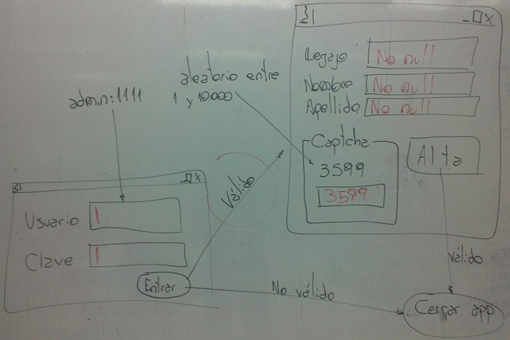

.. -*- coding: utf-8 -*-

.. _rcs_subversion:

Clase 07 - POO 2020
===================
(Fecha: 8 de abril)

QGroupBox
^^^^^^^^^ 

.. figure:: images/clase05/qgroupbox.png

.. code-block:: c

	QGroupBox* grupo = new QGroupBox("Texto");
	QGridLayout* layout = new QGridLayout;
	
	layout->addWidget(label, 0, 0);
	layout->addWidget(usuario, 1, 0, 1, 2);
	layout->addWidget(clave, 2, 0, 1, 2);
	
	grupo->setLayout(layout);

**Ejercicio**

- Convertir a std::string un int
- Similar a lo que hace QString::number( int )

**Ejercicio 4**

- Utilizar el login del ejercicio anterior en un proyecto nuevo.
- Definir la clase Formulario que será un QWidget
- Formulario tendrá QLabels y QLineEdits para Legajo, Nombre y Apellido y un QPushButton
- Si la clave ingresada es admin:1111, se cierra Login y se muestra Formulario

**Ejercicio 5**

	

