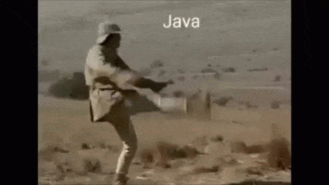

.. -*- coding: utf-8 -*-

.. _rcs_subversion:

Clase 09 - POO 2021
===================
(Fecha: 15 de abril)

- Para crear gifs a partir de videos en youtube en: https://gifs.com 

Sutilezas con punteros
^^^^^^^^^^^^^^^^^^^^^^

.. code-block:: c

	char cadena[ 10 ] = "hola";  
	// Funciona? sí. Qué hace con el sobrante?
	// Los completa a todos con \000

	char cadena[ 4 ] = "hola";   // Por qué no compila?

	char cadena[ 5 ] = "hola";   // Y por qué esto sí compila?

	// Porque la última posición se usa para el carácter nulo que el
	// compilador lo agrega (si tiene lugar).

	//    \000  (octal)
	//    \x0   (hexadecimal)    

Usando puntero para cadenas
^^^^^^^^^^^^^^^^^^^^^^^^^^^

.. code-block:: c

	char * cadena = "hola";      // el compilador agrega \000
	char * cadena = "ho\000la";  // Imprime  ho

- Asignamos memoria dinámicamente.
- No necesitamos especificar la longitud máxima.

Notación octal y hexadecimal
^^^^^^^^^^^^^^^^^^^^^^^^^^^^

.. code-block:: c

	cout << 3 + 4 + 11;      // Imprime 18
	cout << 3 + 4 + 011;     // ?

	//    octal    hexadecimal    decimal
	//    0121     0x51           81
	//    011      0x9            9
	//    '\000'   '\x0'          nulo
	//    '\063'   '\x33'         carácter 3

Punteros a punteros
^^^^^^^^^^^^^^^^^^^

.. code-block:: c

	char cadena[ 2 ][ 3 ];
	cadena[ 0 ][ 0 ] = 'f';
	cadena[ 0 ][ 1 ] = 'u';
	cadena[ 0 ][ 2 ] = 'e';
	cadena[ 1 ][ 0 ] = 'f';
	cadena[ 1 ][ 1 ] = 'u';
	cadena[ 1 ][ 2 ] = 'i';

	//    Mejor así

	char cadena[ 2 ][ 3 ];
	cadena[ 0 ][ 0 ] = 's';
	cadena[ 0 ][ 1 ] = 'i';
	cadena[ 0 ][ 2 ] = '\000';
	cadena[ 1 ][ 0 ] = 'n';
	cadena[ 1 ][ 1 ] = 'o';
	cadena[ 1 ][ 2 ] = '\000';
 
Array ≡ puntero
^^^^^^^^^^^^^^^

- Cuando declaramos un array
- Estamos declarando un puntero al primer elemento.

.. code-block:: c

	char arreglo[ 5 ];
	char * puntero;
	puntero = arreglo;  // Equivale a puntero = &arreglo[0];

Volviendo a puntero a puntero
^^^^^^^^^^^^^^^^^^^^^^^^^^^^^

.. code-block:: c

	char cadena[ 2 ][ 3 ] = { { 's', 'i', '\000' }, { 'n', 'o', '\000' } };
	// Y si fuera char cadena[ 2 ][ 3 ] = { { 's', 'i', '-' }, { 'n', 'o', '\000' } };
	char * p1;
	char * p2;

	p1 = cadena[ 0 ];   // p1 = &cadena[ 0 ][ 0 ];
	p2 = cadena[ 1 ];   // p2 = &cadena[ 1 ][ 0 ];

	cout << p1;  // si  
	cout << p2;  // no
	
	cout << *p1;  // ?
	cout << *p2;  // ?

	// Es decir:
	//    El identificador de un arreglo unidimensional 
	//    es considerado un puntero a su primer elemento.

**Ejemplo**

.. code-block:: c

	char p1[] = { 'a', 'b', 'c', 'd', 'e' };
	cout << "Letra " << *p1;   // Letra a
	cout << "Letra " << p1[ 0 ];   // Letra a

	char m2[][ 5 ] = { { 'a', 'b', 'c', 'd', 'e' }, { 'A', 'B', 'C', 'D', 'E' } };
	cout << "Letra " << **m2;          // Letra a
	cout << "Letra " << m2[ 0 ][ 0 ];      // Letra a
	cout << "Letra " << m2[ 1 ][ 3 ];      // Letra D
	cout << "Letra " << *( *( m2 + 1 ) + 3 );  // Letra D

**Extendiendo a arreglos de cualquier dimensión**

.. code-block:: c

	m[ a ] == *( m + a )
	m[ a ][ b ] == *( *( m + a ) + b )
	m[ a ][ b ][ c ] == *( *( *( m + a ) + b ) + c )

	//    Si nos referimos al primer elemento

	m[ 0 ] == *m
	m[ 0 ][ 0 ] == **m
	m[ 0 ][ 0 ][ 0 ] == ***m

**Array como parámetro en funciones**

.. code-block:: c

	#include <iostream>
	using namespace std;

	void funcion( int miArray[] );
	// Le estamos pasando un puntero al primer elemento del array.

	int main()  {
	    int miA[ 5 ] = { 0, 1, 2, 3, 4 };

	    funcion( miA );

	    cout << miA[ 0 ] << miA[ 1 ] << miA[ 2 ] << miA[ 3 ] << miA[ 4 ];
	}

	void funcion( int miArray[] )  {
	    miArray[ 0 ] = 5;  // Las modificaciones quedarán.

	    miArray[ 3 ] = 5; 
	} 

Parámetros desde la línea de comandos
^^^^^^^^^^^^^^^^^^^^^^^^^^^^^^^^^^^^^

- Escribir el siguiente programa y ejecutarlo desde la línea de comandos incluyendo parámetros:

.. code-block:: c

	#include <iostream>

	int main( int argc, char** argv )  {
	    std::cout << "Hay " << argc << " argumentos:" << std::endl;
	    for ( int i = 0; i < argc; ++i ) {
	        std::cout << argv[ i ] << std::endl;
	    }
	}

