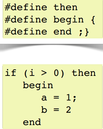

.. -*- coding: utf-8 -*-

.. _rcs_subversion:

Clase 10 - POO 2021
===================
(Fecha: 20 de abril)

Para escuchar buena música y relajar mientras escribimos código
^^^^^^^^^^^^^^^^^^^^^^^^^^^^^^^^^^^^^^^^^^^^^^^^^^^^^^^^^^^^^^^

Dibujar a mano sobre un QWidget
^^^^^^^^^^^^^^^^^^^^^^^^^^^^^^^

.. code-block:: c

	// mapa.h
	#include <QWidget>

	class Mapa : public QWidget  {
	    Q_OBJECT

	public:
	    Mapa()  {  }

	protected:
	    void paintEvent(QPaintEvent *);

	};

	// mapa.cpp
	#include "mapa.h"
	#include <QPainter>

	void Mapa::paintEvent(QPaintEvent *)  {
	    QPainter painter(this);
	    painter.drawLine(0, 0, this->width(), this->height());
	}

**Clase QPainter**

- Pinta a bajo nivel sobre widgets.
- Debe ser utilizado dentro del método ``paintEvent(QPaintEvent*)``.

.. code-block:: c

	void drawEllipse(int x, int y, int ancho, int alto)
	void drawImage(int x, int y, QImage & image)
	void drawLine(int x1, int y1, int x2, int y2)
	void drawText(int x, int y, QString & text)
	void fillRect(int x, int y, int ancho, int alto)
	
**Ejercicio 15:** Comenzar un proyecto vacío con QtCreator y diseñar un login de usuarios:
 
.. figure:: images/clase07/login.png 

- Tendrá un tamaño de 250x120 píxeles y llevará por título "Login".
- El único usuario válido es: (DNI del alumno):(últimos 3 números del DNI)
- Ocultar con asteriscos la clave.
- Si el usuario y clave no es válido, sólo el campo de la clave se deberá limpiar.
- Al fallar la clave 3 veces, la aplicación se cierra. 
- Si el usuario es válido, entonces se oculta el login y se visualiza un nuevo QWidget como el que sigue:

.. figure:: images/clase07/ventana.png

- Utilizar una imagen del disco aproximadamente de 100x100 píxeles.
- Esta imagen se mostrará en el QWidget exactamente centrada.
- Dibujar además un cuadrado que envuelva la imagen (como muestra el ejemplo).
- La ventana puede tener cualquier tamaño pero llevará por título "Ventana".

QByteArray
^^^^^^^^^^

- Se podría decir que es administrador de un char*
- Se puede usar el operador []
- Almacena \\000 al final de cada objeto QByteArray

El preprocesador
^^^^^^^^^^^^^^^^

-	Analiza el archivo fuente antes de la compilación real
-	Realiza las sustituciones de macros
-	Una macro es un patrón de sustitución formado por expresiones textuales
-	Procesa las directivas (``#include``, ``#define``, ``#ifndef``, ...)
-	Elimina los comentarios.

**Directivas #ifdef #endif #ifndef**

- Con ``#ifdef`` si la macro está definida, entonces hace lo siguiente hasta encontrar un ``#endif``
- ``#ifndef`` pregunta si no está definida

**Directiva #include**

- Inserta archivos
- Influye sobre el ámbito y los identificadores

.. code-block:: c

	#include <nombre de fichero cabecera>
	#include "nombre de fichero de cabecera"

**Directiva #define**

- Define macros para sustituir cada vez que se encuentre el identificador.

.. code-block:: c

	#define identificador <secuencia>
	
-	Si 'secuencia' no existe, el identificador será eliminado cada vez que aparezca
-	No es necesario añadir un punto y coma al final
-	Termina en el primer retorno de línea encontrado
-	Podríamos definir un nuevo lenguaje
 

**Ejercicio 16:**

- Nuevo proyecto Empty 
- Crear un .h vacío y definir una clase Persona con int edad y string nombre.
- En el archivo ``main.cpp`` incluir dos veces el archivo .h
- Tratar de resolver el problema sólo modificando el .h

Guardián de inclusión múltiple
^^^^^^^^^^^^^^^^^^^^^^^^^^^^^^

- Este problema se soluciona con el uso del **Guardián de inclusión múltiple**:

.. code-block:: c

	#ifndef PRINCIPAL_H
	#define PRINCIPAL_H

	// . . . 

	#endif // PRINCIPAL_H

QTextEdit
^^^^^^^^^

- Un QWidget que muestra texto plano o enriquecido
- Puede mostrar imágenes, listas y tablas
- La barra de desplazamiento es automática
- Interpreta tags HTML
- Seteamos texto con setPlainText()

**Ejercicio 17**

- Crear una aplicación que inicie con un login validando el usuario admin:123
- Luego de ingresar el usuario válido, mostrar un nuevo QWidget con las siguientes características:
	- Definida en la clase Editor
	- Contendrá un QTextEdit vacío, un QPushButton "Buscar" y un QLabel
	- El usuario podrá escribir cualquier texto en el QTextEdit
	- Al presionar "Buscar" se detectará automáticamente la cantidad de letras 'a' en el texto y colocará el resultado en el QLabel.
- Luego de dejar funcionando lo anterior, agregar lo siguiente:
	- Un QLineEdit y un QPushButton "Borrar"
	- En este QLineEdit el usuario puede colocar una palabra o frase
	- Al presionar Borrar se buscará en el texto y se eliminarán

