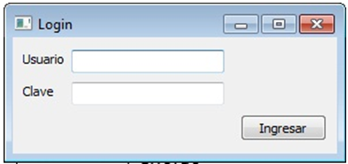

.. -*- coding: utf-8 -*-

.. _rcs_subversion:

Clase 10 - POO 2020
===================
(Fecha: 21 de abril)

.. figure:: images/clase09/java_vs_cplusplus.gif

- Para crear gifs a partir de videos en youtube en: https://gifs.com 

Dibujar a mano sobre un QWidget
^^^^^^^^^^^^^^^^^^^^^^^^^^^^^^^

.. code-block:: c

	// mapa.h
	#include <QWidget>

	class Mapa : public QWidget  {
	    Q_OBJECT

	public:
	    Mapa()  {  }

	protected:
	    void paintEvent(QPaintEvent *);

	};

	// mapa.cpp
	#include "mapa.h"
	#include <QPainter>

	void Mapa::paintEvent(QPaintEvent *)  {
	    QPainter painter(this);
	    painter.drawLine(0, 0, this->width(), this->height());
	}

**Clase QPainter**

- Pinta a bajo nivel sobre widgets.
- Debe ser utilizado dentro del método ``paintEvent(QPaintEvent*)``.

.. code-block:: c

	void drawEllipse(int x, int y, int ancho, int alto)
	void drawImage(int x, int y, QImage & image)
	void drawLine(int x1, int y1, int x2, int y2)
	void drawText(int x, int y, QString & text)
	void fillRect(int x, int y, int ancho, int alto)
	
**Ejercicio 7:** Comenzar un proyecto vacío con QtCreator y diseñar un login de usuarios:
 

- Tendrá un tamaño de 250x120 píxeles y llevará por título "Login".
- El único usuario válido es: (DNI del alumno):(últimos 3 números del DNI)
- Ocultar con asteriscos la clave.
- Si el usuario y clave no es válido, sólo el campo de la clave se deberá limpiar.
- Al fallar la clave 3 veces, la aplicación se cierra. 
- Si el usuario es válido, entonces se oculta el login y se visualiza un nuevo QWidget como el que sigue:

.. figure:: images/clase07/ventana.png

- Utilizar una imagen del disco aproximadamente de 100x100 píxeles.
- Esta imagen se mostrará en el QWidget exactamente centrada.
- Dibujar además un cuadrado que envuelva la imagen (como muestra el ejemplo).
- La ventana puede tener cualquier tamaño pero llevará por título "Ventana".

Clases derivadas
^^^^^^^^^^^^^^^^

.. code-block:: c
 
	// personal.h
	#include <QString>

	class Personal  {
	public:
	    QString verEdad()  {  return "Edad: " + QString::number(edad);  }
	    QString verSalario()  {  return "Salario: " + QString::number(salario);  }

	protected:  // Para acceso desde las clases derivadas
	    int edad;
	    int salario;
	};

	// Modificadores de acceso para Herencia:
	//    public  ->  Mantiene los modificadores de acceso de la clase base
	//    private ->  Pasa todo a privado
	class Desarrollador : public Personal  {
	public:
	    Desarrollador(int edad)  {
	    salario = 2000;
	    this->edad = edad;
	}

	// Se podrá usar? 
	Desarrollador(int edad) : salario(2000), edad(edad)  {  }
	    // No. Sólo para miembros de la propia clase (no para heredados).
	};

	class Administrador : public Personal  {
	public:
	    Administrador()  {
	        salario = 2000;
	        edad = 30;
	    }
	};

	#include <QApplication>
	#include "personal.h"
	#include <QDebug>

	int main(int argc, char** argv)  {
	    QApplication a(argc, argv);

	    Desarrollador juan(20);
	    Administrador marcos;

	    qDebug() << juan.verEdad();
	    qDebug() << juan.verSalario();

	    qDebug() << marcos.verEdad();
	    qDebug() << marcos.verSalario();

	    return a.exec();
	}

Constructor de la clase derivada
^^^^^^^^^^^^^^^^^^^^^^^^^^^^^^^^

.. code-block:: c

	class Persona  {
	public:
	    Persona(int edad) : edad(edad)  {  }
	    QString verEdad()  {  return "Edad: " + QString::number(edad);  }
	    void setEdad(int edad)  {  this->edad = edad;  }

	protected:
	    int edad;
	};

	class Empleado : public Persona  {
	public:
	    // Siempre primero se llama al constructor de la clase base
	    Empleado(int edad, int salario) : Persona(edad), salario(salario)  {  }
	    QString verSalario()  {  return "Salario: " + QString::number(salario);  }

	protected:
	    int salario;
	};

	#include <QApplication>
	#include "personal.h"
	#include <QDebug>

	int main(int argc, char** argv)  {
	    QApplication a(argc, argv);

	    Persona carlos(24);
	    Empleado ale(20, 2500);

	    qDebug() << carlos.verEdad();
	    //    qDebug() << carlos.verSalario();  // No compila. No está en la clase base.

	    qDebug() << ale.verEdad();
	    qDebug() << ale.verSalario();

	    return a.exec();
	}

