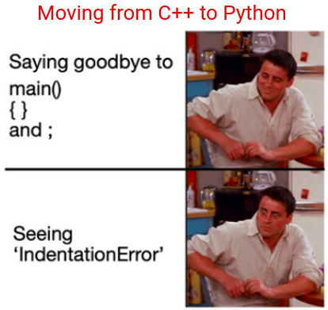

.. -*- coding: utf-8 -*-

.. _rcs_subversion:

Clase 15 - POO 2021
===================
(Fecha: 6 de mayo)

Función virtual pura y clase abstracta
^^^^^^^^^^^^^^^^^^^^^^^^^^^^^^^^^^^^^^

- No necesita ser definida, sólo se declara.
- Será definida en las clases derivadas

.. code-block:: c

	virtual void verValor( int a ) = 0;

- Algunos pueden decir que no es muy elegante igualar a cero una función:

.. code-block:: c

	#define abstracta =0

	// entonces podemos usar:
	virtual void verValor( int a ) abstracta;

- Una clase con al menos una función virtual pura la convierte en clase abstracta.
- Una clase abstracta no puede ser instanciada.
- Si en la clase derivada no se define la función virtual pura, significa que esta clase derivada también es abstracta.

.. code-block:: c

	#define abstracta =0

	class Persona  {
	public:
	    Persona( QString nombre ) : nombre( nombre )  {  }
	    virtual QString verNombre() abstracta;

	protected:  
	    QString nombre;
	};

	class Empleado : public Persona  {
	public:
	    Empleado( QString nombre ) : Persona( nombre )  {  }
	    QString verNombre()  {  return "Empleado: " + nombre;  }
	};

	int main( int argc, char** argv )  {
	    QApplication a( argc, argv );

	    {
	    Persona * carlos = new Empleado( "Carlos" );

	    qDebug() << carlos->verNombre();

	    delete carlos;
	    }

	    return a.exec();
	}

