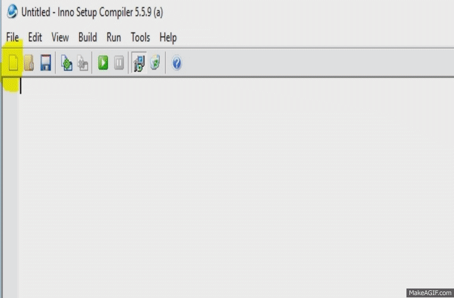

.. -*- coding: utf-8 -*-

.. _rcs_subversion:

Clase 22 - POO 2020
===================
(Fecha: 02 de junio)

:Tarea para Clase 22:
	Mini examen para resolver en 50 minutos + 10 minutos para subir el examen a MiUBP

	QtDesigner, señales propias, QFileDialog, QTimer, clase propia en QtDesigner, QFile, const

	Funciones virtuales de QWidget para: mouseDoubleClickEvent, mouseMoveEvent, mousePressEvent, mouseReleaseEvent, keyPressEvent, keyReleaseEvent, resizeEvent, moveEvent, closeEvent, hideEvent, showEvent y paintEvent

Creando Instalador
^^^^^^^^^^^^^^^^^^

**Mexican explanation**

|ImageLink|_ 

.. |ImageLink| image:: /images/clase14/mexicano.gif
.. _ImageLink: https://www.youtube.com/watch?v=rr6G7GU52Wc

**Capturas de pantalla de la creación**

**Ejercicio 21**

- Diseñar una aplicación que muestre en un ``QWidget`` cualquier imagen de 50x50
- La imagen deberá seguir al puntero del mouse cuando esté presionado un botón.
- Utilizar ``QTimer`` para actualizar la posición de la imagen dando un efecto inercial

Ejecutable del ejercicio de arrastrar y soltar la imagen
........................................................

- `Descargar Instalador de MouseMove (Windows 7 o superior - 64 bits) <https://drive.google.com/file/d/0B3bNJFNPgLHnc3ota21TVVBKb0k/view?usp=sharing>`_

- `Descargar MouseMove (Linux - 64 bits) <https://drive.google.com/file/d/0B3bNJFNPgLHnMGtzWjlQa3RIc1E/view?usp=sharing>`_

const
^^^^^

- Una variable definida como const no podrá ser modificada a lo largo del programa (se crea como sólo lectura)
- Se puede aplicar a cualquier tipo:

.. code-block:: c	

	const float pi = 3.14;
	const peso = 67;  // Si no se indica el tipo entonces es int
	                  // Aunque sólo en compiladores viejos

const con punteros
^^^^^^^^^^^^^^^^^^

.. code-block:: c	

	int x = 10;
	int * px = &x;  // normal

	const int y = 10;
	int * py = &y;  // El compilador dirá: "invalid conversion from const int*
	               // to int*". La inversa sí se permite

	int y = 10;
	const int * py = &y;  // permitido (pero el contenido es de sólo lectura)

	*py = 6;  // No permitido. El contenido apuntado es de sólo lectura

const en parámetros de funciones
^^^^^^^^^^^^^^^^^^^^^^^^^^^^^^^^

- Cuando los parámetros son punteros, decimos que no podrá modificar los objetos referenciados

.. code-block:: c	

	int funcion( const char * ch )

- Lo mismo sucede con referencias

.. code-block:: c	

	int funcion( const char& ch )

const en clases
^^^^^^^^^^^^^^^

.. code-block:: c	

	class ClaseA  {
	    const int i;
	    int x;

	public:
	    int funcion( ClaseA cA, const ClaseA &c )  {
	        cA.x = 1;
	        cA.i = 2;  // No compila. i es de sólo lectura.
	        c.x = 3;   // No compila. El objeto c es de sólo lectura.

	        return cA.x;
	    }
	}; 

.. code-block:: c	

	// A la variable i sólo la puede inicializar el constructor y sólo con la forma:
	ClaseA() : i( 8 )  {  }   

	// Si en el cuerpo del constructor se hace:
	ClaseA()  { 
	    i = 8;  // Compila? i es de solo lectura o no
	}   

- Aplicado a métodos de una clase no permite modificar ninguna propiedad de la clase

.. code-block:: c	

	class ClaseB  {
	    int x;

	    void funcion( int i ) const  {
	        x = x + i;  // Compila?
	    }
	};

Clase QFile
^^^^^^^^^^^

- Permite leer y escribir en archivos. 
- Puede ser utilizado además con ``QTextStream`` o ``QDataStream``.

.. code-block:: c	

	QFile( const QString & name )
	viod setFile( const QString & name )

- Existe un archivo? y lo eliminamos.

.. code-block:: c	

	bool exists() const
	bool remove()

- Lectura de un archivo línea por línea:

.. code-block:: c	

	QFile file( "c:/in.txt" );
	if ( !file.open ( QIODevice::ReadOnly | QIODevice::Text ) )
	    return;

	while ( !file.atEnd() )  {
	    QByteArray linea = file.readLine();
	    qDebug() << linea;
	}

**Ejercicio 22**

- Elegir un archivo de texto cualquiera con ``QFileDialog`` y mostrarlo sobre un ``QTextEdit``.
- Agregar dos ``QLineEdit``, uno acompañado con el ``QLabel`` "Buscar" y otro con el "Reemplazar por".
- Un botón "Reemplazar" realizará la busqueda reemplazará todas las coincidencias encontradas.

**Ejercicio 23**

- En el ejercicio anterior emitir la señal ``signal_reemplazosFinalizados( int cantidad )`` al finalizar la acción.
- ``int cantidad`` indicará la cantidad de reemplazos realizados, incluyendo el cero si no hubo reemplazos.
- Conectar esta señal con algún slot cualquiera para probar su funcionamiento.

Enumeraciones
^^^^^^^^^^^^^

- Es un tipo especial de variable
- Sus valores son constantes enteras
- Estos valores pueden ser autogenerados (0, 1, 2, 3, ...)

.. code-block:: c	

	enum los_dias { DOM, LUN, MAR, MIE, JUE, VIE, SAB } dia;

	enum los_dias { DOM = 7, LUN = 1, MAR, MIE, JUE = 0, VIE, SAB };

- Las variables de este tipo pueden adoptar sólo valores DOM, LUN, ...
- Es decir, la variable "dia" puede tomar DOM o LUN o MAR ...
- Las enumeraciones declaradas dentro de una clase tiene la visibilidad de la clase

.. code-block:: c	

	class Dia  {
	public:
	    enum los_dias { LUN, MAR, MIE, JUE, VIE };
	    int un_dia;
	};

	int main( int argc, char ** argv )  {
	    Dia d1;
	    d1.un_dia = Dia::LUN;
	}

**Ejemplo**

.. code-block:: c	

	// figura.h
	class Figura : public QWidget  {
	    Q_OBJECT

	public:
	    enum Forma { CIRCULO, CUADRADO };

	    Figura( QWidget * parent = 0 );

	    void dibujar( Forma forma );

	protected:
	    void paintEvent( QPaintEvent * );

	private:
	    Forma forma;
	};

	// figura.cpp
	Figura::Figura( QWidget * parent ) : QWidget( parent ), forma( CIRCULO )  {  }

	void Figura::dibujar( Forma forma )  {
	    this->forma = forma;
	    this->repaint();
	}

	void Figura::paintEvent( QPaintEvent * )  {
	    QPainter pincel( this );
	    
	    switch( forma )  {
	    case CIRCULO:
	        // dibujar circulo
	        break;

	    case CUADRADO:
	        // dibujar cuadrado
	        break;

	    default:;
	    }
	}

	// main.cpp
	int main( int argc, char ** argv )  {
	    QApplication a( argc, argv );

	    Figura figura;
	    figura.dibujar( Figura::CUADRADO );
	    figura.show();

	    return a.exec();
	}

Herencia múltiple
^^^^^^^^^^^^^^^^^

- La clase derivada hereda todos los datos y funciones de todas las clases base
- Puede suceder que en la clases base existan funciones con igual nombre
- Los casos de ambigüedad se solucionan con el nombre completo
- Otra solución sería redefinir en la derivada la función ambigua.

.. code-block:: c	

	#include <QApplication>
	#include <QDebug>

	class ClaseA  {
	public:
	    ClaseA( int a ) : valorA( a )  {  }
	    int verValor()  {  return valorA;  }

	protected:
	    int valorA;
	};

.. code-block:: c	

	class ClaseB  {
	public:
	    ClaseB() : valorB( 20 )  {  }
	    int verValor()  {  return valorB;  }

	protected:
	    int valorB;
	};

.. code-block:: c	

	class ClaseC : public ClaseA, public ClaseB  {
	public:
	    ClaseC( int c ) : ClaseA( c ), ClaseB()  {  }
	    int verValor()  {  return ClaseA::verValor();  }
	};

.. code-block:: c	

	int main( int argc, char ** argv )  {
	    QApplication a( argc, argv );

	    ClaseC c( 10 );
	    qDebug() << c.verValor();  
	    qDebug() << c.ClaseB::verValor();  

	    return 0;
	}

**Ejemplo**

.. code-block:: c	

	class Persona  {
	private:
	    int edad;
	    int x, y;

	public:
	    Persona( int edad = 0 ) : edad( edad ), x( 0 ), y( 0 )  {  }

	    void move( int x, int y )  {
	        this->x = x;
	        this->y = y;
	    }
	};

	class Jugador : public Persona, public QWidget  {
	private:
	    int id;

	public:
	    Jugador() : Persona( 18 ), QWidget(), id( 0 )  {  }

	    void mudarse( int x, int y )  {
	        this->id++;
	        this->Persona::move( x, y );  // Se requiere especificar de esta manera
	    }
	};
	    

