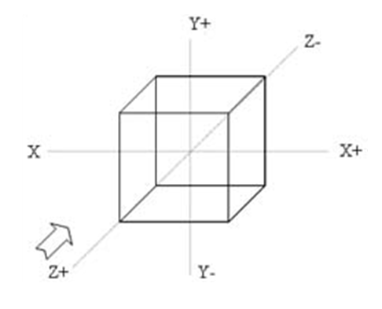
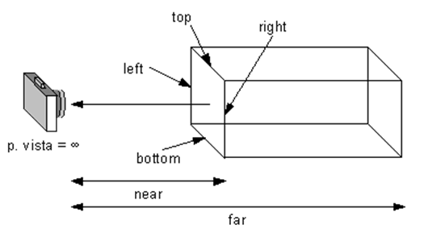
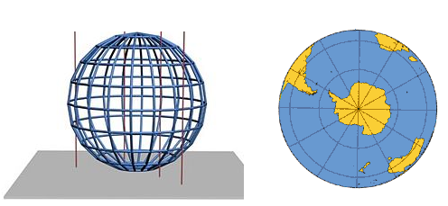
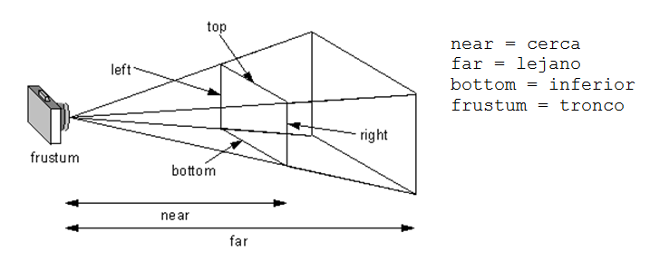
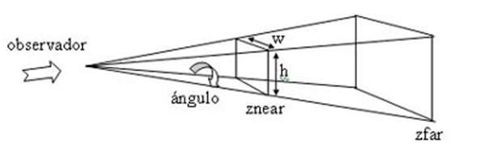
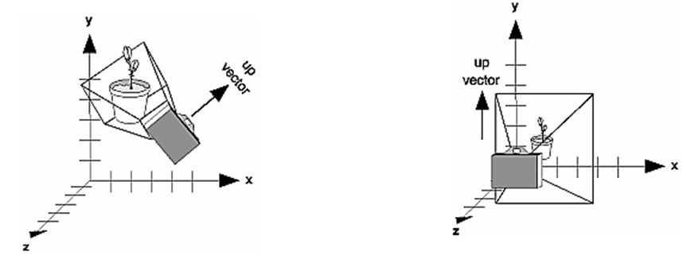

.. -*- coding: utf-8 -*-

.. _rcs_subversion:

Clase 26 - POO 2020
===================
(Fecha: 17 de junio)

:Tarea para Clase 24:
	Ver `Tutorial Qt QWidget <https://www.youtube.com/watch?v=NpwRtpndqA4>`_ de `Videos tutoriales de Qt <https://www.youtube.com/playlist?list=PL54fdmMKYUJvn4dAvziRopztp47tBRNum>`_

	Ver `Tutorial Qt QFile <https://www.youtube.com/watch?v=zDA5FKfRxJA>`_ de `Videos tutoriales de Qt <https://www.youtube.com/playlist?list=PL54fdmMKYUJvn4dAvziRopztp47tBRNum>`_

	Ver `Tutorial Qt QDir <https://www.youtube.com/watch?v=wfabCN1oJpE>`_ de `Videos tutoriales de Qt <https://www.youtube.com/playlist?list=PL54fdmMKYUJvn4dAvziRopztp47tBRNum>`_

	Ver `Tutorial Qt Resource file <https://www.youtube.com/watch?v=u8xKE0zHLsE>`_ de `Videos tutoriales de Qt <https://www.youtube.com/playlist?list=PL54fdmMKYUJvn4dAvziRopztp47tBRNum>`_	

	Tener listos todos los ejercicios que están en GitHub desde la clase 01 hasta la 20

:Tarea para Clase 22:
	Mini examen para resolver en 50 minutos + 10 minutos para subir el examen a MiUBP

	QtDesigner, señales propias, QFileDialog, QTimer, clase propia en QtDesigner, QFile, const

	Funciones virtuales de QWidget para: mouseDoubleClickEvent, mouseMoveEvent, mousePressEvent, mouseReleaseEvent, keyPressEvent, keyReleaseEvent, resizeEvent, moveEvent, closeEvent, hideEvent, showEvent y paintEvent

**Ejercicio 21**

- Diseñar una aplicación que muestre en un ``QWidget`` cualquier imagen de 50x50
- La imagen deberá seguir al puntero del mouse cuando esté presionado un botón.
- Utilizar ``QTimer`` para actualizar la posición de la imagen dando un efecto inercial

Ejecutable del ejercicio de arrastrar y soltar la imagen
........................................................

- `Descargar Instalador de MouseMove (Windows 7 o superior - 64 bits) <https://drive.google.com/file/d/0B3bNJFNPgLHnc3ota21TVVBKb0k/view?usp=sharing>`_

- `Descargar MouseMove (Linux - 64 bits) <https://drive.google.com/file/d/0B3bNJFNPgLHnMGtzWjlQa3RIc1E/view?usp=sharing>`_

Graficación 3D
==============

OpenGL
^^^^^^

- Open Graphics Library
- Especificación que define una API para dibujar en 2D y 3D.
- Los fabricantes de Hardware se basan en esta especificación.
- Funciones para dibujar escenas complejas desde primitivas geométricas.
- Primitivas geométricas simples: Puntos, líneas y triángulos.
- Desarrollada por Silicon Graphics Inc. (1992).
- En 2006 pasa al Grupo Khronos
- Compite con Direct3D de Microsoft
- Direct3D, DirectShow, DirectSound, DirectPlay y otras, son parte de DirectX.

**Para tener en cuenta**

- Las funciones de OpenGL comienzan con ``gl`` y las constantes con ``GL_``
- Existe un sufijo que indica la cantidad de parámetros y el tipo

.. code-block:: c	

	glVertex3f  // 3 parámetros del tipo float

- OpenGL define sus tipos de datos (con ``typedef``)

.. code-block:: c	

	// (typedef se utiliza para asignar un alias a un tipo)

	typedef int GLint
	typedef float GLfloat	

	// s Entero 16-bits short            GLshort
	// i Entero 32-bits int              GLint
	// f Punto flotante 32-bits float    GLfloat
	// d Punto flotante 64-bits double   GLdouble

**Algunos datos**

- 24 cuadros por segundo notamos es la mínima para percibirlo en movimiento fluido.
- Mayor cantidad de imágenes se verá mejor aún.
- 24 fps y 48 fps se utiliza en el cine.
- 60 fps para televisión de alta definición.
- 90 fps se utilizan para realidad virtual.
- Consolas de juegos, algunos monitores ya usan 144 fps.
- Hay bibliotecas que aportan más funcionalidades: GLU, GLUT, GLEW, etc.
- Las primitivas se componen de vértices (puntos en 3D).
- Perspectiva ortonormal: 
 

- Punto en 3D. 

.. code-block:: c	

	glVertex3f( 10.0f, 5.0f, 3.0f );

.. figure:: images/clase19/punto.png

Dibujando primitivas
^^^^^^^^^^^^^^^^^^^^

**Puntos GL_POINTS**

.. code-block:: c

	glBegin( GL_POINTS );
	    glVertex3f( 0.0f, 0.0f, 0.0f );
	    glVertex3f( 10.0f, 10.0f, 10.0f );
	glEnd();

- Comienza indicando el tipo de primitiva con ``glBegin()``.
- ``glBegin()`` y ``glEnd()`` actúan como llaves, por ello se acomoda de esa forma.
- Un punto por defecto tiene 1 píxel por 1 píxel
- Podemos setear su tamaño:

.. code-block:: c

	glPointSize( 6.0f ); // tamaño del pixel = 6

**Líneas GL_LINES**

.. code-block:: c

	GLfloat angulo;
	int i;

	glBegin( GL_LINES );
	for ( i = 0; i < 360; i+=3 )  {
	    angulo = ( GLfloat )i * 3.14159f / 180.0f; // grados a radianes
	    glVertex3f( 0.0f, 0.0f, 0.0f );
	    glVertex3f( cos( angulo ), sin( angulo ), 0.0f );
	}
	glEnd();

- Dos puntos hacen una recta.
- Con un número impar de puntos, el último se ignora.

**Líneas consecutivas GL_LINE_STRIP**

- El primer punto y el segundo forman una línea.
- El tercer punto forma una línea con el segundo y así sucesivamente.

**Triángulos GL_TRIANGLES**

.. code-block:: c

	glBegin( GL_TRIANGLES );
	    glVertex3f( 0, -1.0f, -0.5f );
	    glVertex3f( 1.0f, -0.9f, -0.5f );
	    glVertex3f( 0.0f, -0.5f, -0.5f );
	glEnd();

**Color de relleno**

- Modificamos el color con ``glColor3f()`` con valores de 0 a 1.

.. code-block:: c

	glBegin( GL_TRIANGLES );
	    glColor3f( 0, 0, 1 );
	    glVertex3f( 0, -1.0f, -0.5f );
	    glVertex3f( 1.0f, -0.9f, -0.5f );
	    glVertex3f( 0.0f, -0.5f, -0.5f );
	glEnd();

Uso de la Clase QGLWidget
^^^^^^^^^^^^^^^^^^^^^^^^^

- Se requiere lo siguiente en el .pro

.. code-block:: c

	QT += opengl

	win32:LIBS += -lopengl32
	win32:LIBS += -lglu32
	
	unix:LIBS += -lGLU

.. code-block:: c

	#include <QGLWidget>

	class MiOpenGL : public QGLWidget  {
	    Q_OBJECT
		
	public:
	    MiOpenGL();

	protected:
	    void initializeGL();	
	    void resizeGL( int w, int h );
	    void paintGL();
	};
	
	MiOpenGL::MiOpenGL()  {
	
	}

	void MiOpenGL::initializeGL()  { 
	    glClearColor( 0, 0, 0, 0 );
	}

	void MiOpenGL::resizeGL( int w, int h )  {
	    // Porción de ventana donde puede dibujar.
	    glViewport( 0, 0, w, h );

	    // Especifica la matriz actual: matriz de proyección (GL_PROJECTION), matriz de modelo
	    // (GL_MODELVIEW) y matriz de textura (GL_TEXTURE). 
	    glMatrixMode( GL_PROJECTION );

	    // Con esto cargamos en el "tipo" de matriz actual (matriz identidad - como resetear).
	    // Es una matriz 4x4 llena de ceros salvo la diagonal que contiene unos. 
	    glLoadIdentity();

	    // Para delimitar la zona de trabajo en una caja.
	    glOrtho( -1, 1, -1, 1, -1, 1 );

	    // Se vuelve a este tipo de matrices, que afecta a las primitivas geométricas.
	    glMatrixMode( GL_MODELVIEW );
	}

	void MiOpenGL::paintGL()  {
	    // Borra un buffer.
	    glClear( GL_COLOR_BUFFER_BIT );

	    //  Carga la matriz identidad.
	    glLoadIdentity();

	    // Acá se inserta el código para dibujar 

	    // Volcamos en pantalla lo que se creó en memoria.
	    glFlush();
	}

**Ejercicio 27**

- Dibujar un triángulo en el plano ``z=-50``
- Utilizar el teclado para que al presionar la tecla C, el triángulo cambie de color.

Rotación de la escena
^^^^^^^^^^^^^^^^^^^^^

- Gira un ángulo en sentido contrario a las agujas del reloj.
- Sobre el eje formado desde el origen hasta el punto (x, y, z).

.. code-block:: c

	// glRotatef( angulo, x, y, z ); 
	glRotatef( 5, 0, 0, 1 );  // gira 5° con respecto al eje z

Traslación de la escena
^^^^^^^^^^^^^^^^^^^^^^^

- Desplaza el punto (0, 0, 0) a la nueva posición (x, y, z).

.. code-block:: c

	// glTranslatef( x, y, z );
	glTranslatef( 2, 0, 0 );  // Desplaza 2 unidades en el eje x

Escalado de la escena
^^^^^^^^^^^^^^^^^^^^^

- Escala. Con valores mayores a 1, se amplía. Entre 0 y 1 se reduce.

.. code-block:: c

	// glScalef( x, y, z );
	glScalef( 1, 2, 1 );  // escala el doble en vertical
	
Objetos ocultos
^^^^^^^^^^^^^^^

- En 3D un objeto puede estar detrás de otro.
- Por defecto, OpenGL no tiene en cuenta esto. Pinta siguiendo el orden en el código fuente,.
- El siguiente código no se vería muy real:

.. code-block:: c

	glColor3f( 0, 1, 0 );
	glBegin( GL_TRIANGLES );
	    glVertex3f( -5, -5, 5 );
	    glVertex3f( 0, 0, 0 );
	    glVertex3f( 5, -5, 5 );
	glEnd();

	glColor3f( 0, 0, 1 );
	glPointSize( 5 );
	glBegin( GL_POINTS );
	    glVertex3f( 0, -1, 0 );
	    glVertex3f( 0, -2, 5 );
	glEnd();

- Para solucionar activamos el buffer de profundidad

.. code-block:: c

	glEnable( GL_DEPTH_TEST ); 

- Cada vez que se renderiza la escena, limpiamos la pantalla

.. code-block:: c

	glClear( GL_COLOR_BUFFER_BIT | GL_DEPTH_BUFFER_BIT );

Seguimiento continuo del mouse
^^^^^^^^^^^^^^^^^^^^^^^^^^^^^^

- Al usar ``mouseMoveEvent`` ¿por qué sólo se sigue al mouse al presionar un botón?

.. code-block:: c

	setMouseTracking(bool enable)

- Es un método de la clase QWidget
- Activa el seguimiento continuo del mouse sobre un QWidget.
- Por defecto se encuentra desactivado.
- Cuando está desactivado sólo se reciben los eventos del movimiento del mouse cuando al menos se presiona un botón del mismo.

**Ejercicio 28**

- Dibujar un cajón deforme sin tapa con un color distinto en cada lado.
- Utilizar el teclado para hacerlo rotar sobre los tres ejes.

Modelo de sombreado
^^^^^^^^^^^^^^^^^^^

- Lo especificamos con la función ``glShadeModel()``. ``(shade = tono - matiz)``
- Si el parámetro es ``GL_FLAT`` se rellena con el úlimo color activo. ``(flat = plano)``
- Con ``GL_SMOOTH`` se interpolan los colores de cada vértice. ``(smooth = suavizar)``

.. code-block:: c
     
	glShadeModel( GL_SMOOTH );	
	glBegin( GL_TRIANGLES );
	    glColor3f( 1, 0, 0 ); // activamos el color rojo
	    glVertex3f( -1.0f, -0.5f, 0.0f );
	    glColor3f( 0, 1, 0 ); // activamos el color verde
	    glVertex3f( 1.0f, 0.0f, 0.0f );
	    glColor3f( 0, 0, 1 ); // activamos el color azul
	    glVertex3f( 0.3f, 1.0f, 0.0f );
	glEnd();

**Transformación de viewport (o vista)**

- Análogamente con una cámara de fotos, es el tamaño de la fotografía.
- Generalmente se inicializa para que ocupe toda la ventana.
- Pensar en la relación ancho / alto.

.. code-block:: c

	void glViewport( GLint x, GLint y, GLsizei width, GLsizei height );
	
**Proyecciones**

- La proyección define el volumen del espacio que va a usarse para formar la imagen.
- Los vértices de la escena es afectada por la matriz de proyección.
- Es necesario activarla e inicializarla:

.. code-block:: c

	glMatrixMode( GL_PROJECTION );
	glLoadIdentity();

**Proyección ortogonal**

- Define un volumen de la vista como una "caja".
- La distancia de un objeto a la cámara no influye en su tamaño.

.. code-block:: c

	void glOrtho( GLdouble left, GLdouble right, 
	              GLdouble bottom, GLdouble top, 
	              GLdouble near, GLdouble far )

**Proyección perspectiva**

- Define un volumen de la vista como una pirámide truncada (o frustum).
- Los objetos aparecen más pequeños mientras más alejados están de la cámara.

.. code-block:: c

	void glFrustum( GLdouble left, GLdouble right, 
	                GLdouble bottom, GLdouble top, 
	                GLdouble near, GLdouble far )
	

.. code-block:: c

	void gluPerspective(angulo, aspecto, znear, zfar);

- Es muy común usar:

.. code-block:: c

	gluPerspective( 45.0f, ( GLfloat )( width / height ), 0.01f, 100.0f );
	// donde width y height es el ancho y alto de la escena

- Para utilizar ``gluPerspective`` es necesario linkear a la librería en el .pro:

.. code-block:: c
	
	// Para Linux
	unix:LIBS += "/usr/lib/x86_64-linux-gnu/libGLU.so"

	// Para Windows
	win32::LIBS += -lGLU	

	// Posiblemente también requiera incluir el archivo de cabecera:
	#include <GL/glu.h>

**Ejercicio 29**

- Dibujar un triángulo dentro del campo de visión de la escena.
- Active un temporizador (100 ms) para que gire 3° el triángulo sobre el eje z.	
		   

**Posicionando la cámara**

- La siguiente función realiza el efecto del posicionamiento de la cámara.

.. code-block:: c

	void gluLookAt( GLdouble ojoX, GLdouble ojoY, GLdouble ojoZ, 
	                GLdouble haciaX, GLdouble haciaY, GLdouble haciaZ, 
	                GLdouble upX, GLdouble upY, GLdouble upZ )
				   

**Ejercicio 30**

- Marcar 4 puntos en la escena donde se haga clic con el mouse.
- Ni bien se marque el 4to, automáticamente se generará el polígono de 4 vértices.
- Con la tecla C se puede cambiar entre distintos colores de relleno.
- Con A y D se rota sobre el eje Y.
- Con W y S se rota sobre el eje X.

**Ejercicio 31**

- Dibujar un cuadrado cualquiera en el plano z=-2.
- Controlar la posición de la cámara con las teclas.
- La cámara siempre vertical y mirando al punto ( 0, 0, -100 ).

**Ejercicio 32**

- Dibujar una ruta con la línea blanca interrumpida.
- Con las teclas Up y Down acelerar y frenar

